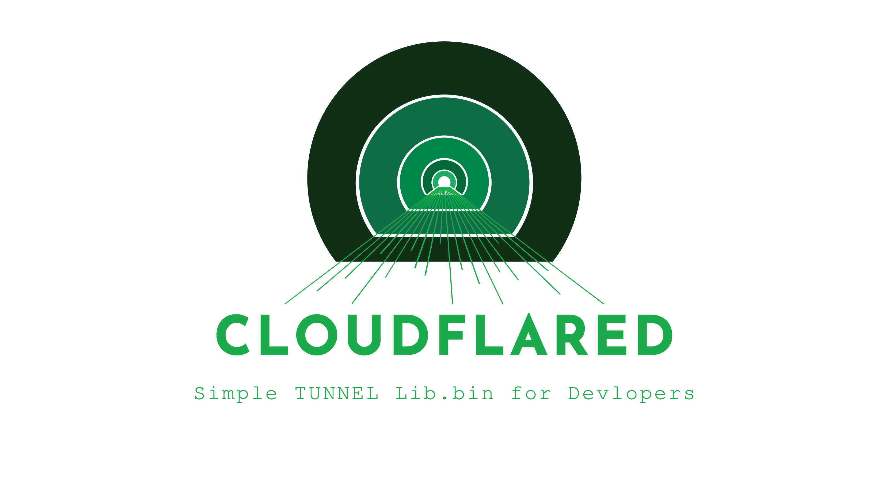

<p align="center">
    
</p>


<div align="center">

**Embeddable Cloudflared with Programmatic Tunnel Access**

Run Cloudflare tunnels across desktop and mobile platforms with **prebuilt binaries**,  
**shared libraries**, and **clean automation support** — no Go toolchain required.

[](#)
[](#)
[](#)
[](#)
[](#)

</div>


<!--

<div align="center">

[](#) <br>
[](#)
[](#)
[](#)
[](#)
[](#)
[](#)
[](#)

</div>

-->

## Why The Hell Is This Here?

Ever wondered why this repo exists? So did we! Maybe you want to run Cloudflare tunnels on Windows, Linux, macOS, or even Android, without the hassle of compiling Go code or hunting for binaries. Maybe you just like tunnels. Or maybe you just want to see if your VPN is lying to you. Either way, this project gives you:

- Prebuilt binaries for every platform (even the weird ones)
- DLL/SO/DYLIB for embedding in your own apps
- Python utilities for scripting, automation, and fun
- A reason to say "it just works" (most of the time)

If you’re reading this, you’re probably either a developer, a hacker, or just lost. Welcome! <br>
Also it was requested in [cloudflared Issue #1402](https://github.com/cloudflare/cloudflared/issues/1402) so here we are.
## Cloudflared DLL Build


Build [cloudflared](https://github.com/cloudflare/cloudflared) as a shared library (DLL/SO/DYLIB).

## Quick Start

### Using the DLL/SO/DYLIB Directly:
* Here's a quick example of loading and using the DLL in Python:*
```bash
# 1. Load DLL
python test.py binaries/windows-amd64/cloudflared-windows-amd64.dll

# 2. Or use in your code:
import ctypes
lib = ctypes.CDLL("cloudflared.dll")
lib.CloudflaredInit()
lib.CloudflaredRun(b"cloudflared tunnel --url http://localhost:8080 --protocol http2")
# ... your app runs ...
lib.CloudflaredStop()
```

### Or use the Python utilities:
See the `python/` folder for scripts to check connectivity, detect VPNs, manage tunnels, and download binaries:

```bash
cd python
python main.py
```

## Exported Functions

| Function                         | Description                   |
| -------------------------------- | ----------------------------- |
| `CloudflaredInit()`              | Initialize (call once)        |
| `CloudflaredRun(char* args)`     | Run tunnel command (async)    |
| `CloudflaredRunSync(char* args)` | Run tunnel command (blocking) |
| `CloudflaredStop()`              | Shutdown gracefully           |
| `CloudflaredVersion()`           | Get version string            |

## Platforms (12)

| Platform                  | File     |
| ------------------------- | -------- |
| Windows x64/x86           | `.dll`   |
| Linux x64/x86/ARM64/ARM   | `.so`    |
| macOS Intel/ARM64         | `.dylib` |
| Android ARM64/ARM/x64/x86 | `.so`    |

## Important: Protocol Selection

> **Use `--protocol http2`** if you have firewall/network issues!

```bash
# QUIC (default) - uses UDP, often blocked by firewalls
cloudflared tunnel --url http://localhost:8080

# HTTP/2 - uses TCP, works through most firewalls ✓
cloudflared tunnel --url http://localhost:8080 --protocol http2
```

## Why QUIC Fails

QUIC uses UDP which is often blocked by:

- Corporate firewalls
- VPNs
- Some ISPs
- Windows Firewall with strict rules

**Solution**: Add `--protocol http2` to use TCP instead.

## Build It Yourself

```bash
# 1. Clone
git clone https://github.com/cloudflare/cloudflared.git

# 2. Apply modifications
python updates/replace.py ./cloudflared

# 3. Build
cd cloudflared
go build -buildmode=c-shared -o cloudflared.dll ./cmd/cloudflared
```

## Files Modified

| File             | Change                   |
| ---------------- | ------------------------ |
| `main.go`        | Added `runAppWithArgs()` |
| `lib_bin_exports.go` | **NEW** - C exports      |
| `*_service.go`   | Accept args parameter    |

## GitHub Actions

Builds run automatically and commit to `binaries/` folder.

## License

Apache 2.0 (same as cloudflared)
